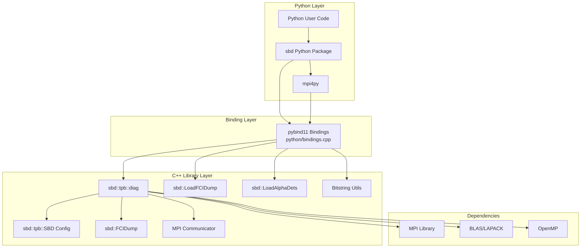
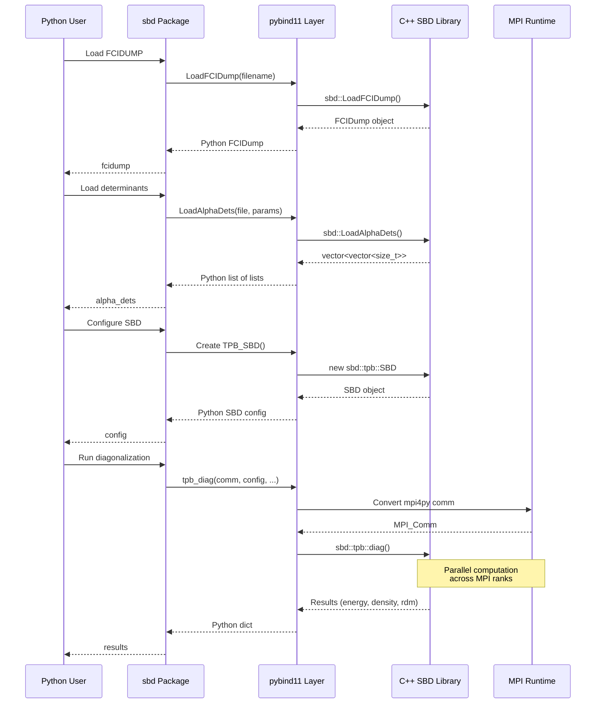
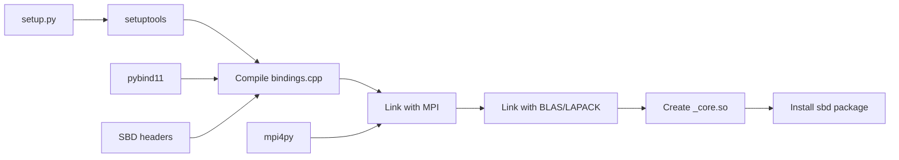
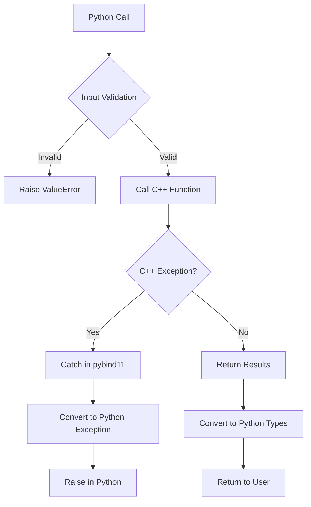
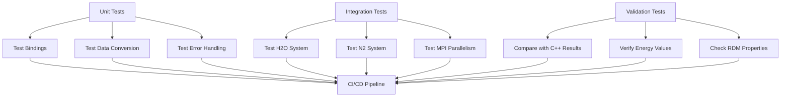
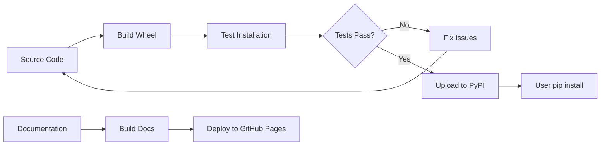

# Python Bindings Architecture for SBD Library

## System Architecture



## Data Flow Diagram



## Module Structure

```
sbd (Python Package)
├── __init__.py
│   ├── Imports core bindings
│   ├── Defines high-level API
│   └── Version info
│
├── _core (C++ Extension Module)
│   ├── FCIDump class
│   ├── TPB_SBD class
│   ├── LoadFCIDump()
│   ├── LoadAlphaDets()
│   ├── makestring()
│   ├── from_string()
│   └── tpb_diag()
│
└── tests/
    ├── test_basic.py
    └── test_h2o.py
```

## Type Mapping

| C++ Type | Python Type | Notes |
|----------|-------------|-------|
| `std::string` | `str` | Direct mapping |
| `double` | `float` | Direct mapping |
| `int` | `int` | Direct mapping |
| `size_t` | `int` | Automatic conversion |
| `std::vector<double>` | `list[float]` | Can convert to numpy array |
| `std::vector<std::vector<size_t>>` | `list[list[int]]` | Nested lists |
| `std::map<std::string, std::string>` | `dict[str, str]` | Direct mapping |
| `MPI_Comm` | `mpi4py.MPI.Comm` | Via mpi4py API |
| `sbd::FCIDump` | `sbd.FCIDump` | Custom class binding |
| `sbd::tpb::SBD` | `sbd.TPB_SBD` | Custom class binding |

## Function Signatures

### Python API
```python
# Load FCIDUMP file
fcidump: FCIDump = sbd.LoadFCIDump(filename: str) -> FCIDump

# Load determinants
alpha_dets: list[list[int]] = sbd.LoadAlphaDets(
    filename: str,
    bit_length: int,
    total_bit_length: int
) -> list[list[int]]

# Bitstring utilities
bitstring: list[int] = sbd.from_string(
    s: str,
    bit_length: int,
    total_bit_length: int
) -> list[int]

string_repr: str = sbd.makestring(
    config: list[int],
    bit_length: int,
    total_bit_length: int
) -> str

# Main diagonalization
results: dict = sbd.tpb_diag(
    comm: MPI.Comm,
    sbd_data: TPB_SBD,
    fcidump: FCIDump,
    adet: list[list[int]],
    bdet: list[list[int]],
    loadname: str = "",
    savename: str = ""
) -> dict[str, Any]
```

### Return Dictionary Structure
```python
{
    'energy': float,                    # Ground state energy
    'density': list[float],             # Orbital densities
    'carryover_adet': list[list[int]], # Important alpha determinants
    'carryover_bdet': list[list[int]], # Important beta determinants
    'one_p_rdm': list[list[float]],   # 1-particle RDM (if do_rdm=1)
    'two_p_rdm': list[list[float]]    # 2-particle RDM (if do_rdm=1)
}
```

## Build Process



## MPI Integration Details

### Communicator Conversion
```cpp
// In bindings.cpp
#include <mpi4py/mpi4py.h>

// Initialize mpi4py
if (import_mpi4py() < 0) {
    throw std::runtime_error("Failed to import mpi4py");
}

// Convert Python MPI.Comm to C MPI_Comm
PyObject* py_comm_ptr = py_comm.ptr();
MPI_Comm* comm_ptr = PyMPIComm_Get(py_comm_ptr);
MPI_Comm comm = *comm_ptr;
```

### Python Usage
```python
from mpi4py import MPI

# Get communicator
comm = MPI.COMM_WORLD
rank = comm.Get_rank()
size = comm.Get_size()

# Pass to C++ function
results = sbd.tpb_diag(comm=comm, ...)

# Results available on all ranks
if rank == 0:
    print(f"Energy: {results['energy']}")
```

## Error Handling Strategy



## Performance Considerations

### Memory Management
- **Zero-copy where possible**: Use `py::array_t` for numpy arrays
- **Move semantics**: Transfer ownership of large vectors
- **Reference counting**: Let Python manage object lifetimes

### GIL Handling
```cpp
// Release GIL for long computations
py::gil_scoped_release release;
sbd::tpb::diag(...);  // C++ computation
py::gil_scoped_acquire acquire;
// Convert results to Python
```

### Data Locality
- Minimize Python/C++ boundary crossings
- Batch operations when possible
- Use contiguous memory layouts

## Testing Strategy



## Deployment Workflow



## Example Usage Patterns

### Pattern 1: Simple Calculation
```python
import sbd
from mpi4py import MPI

comm = MPI.COMM_WORLD
fcidump = sbd.LoadFCIDump("fcidump.txt")
dets = sbd.LoadAlphaDets("dets.txt", 20, 36)

config = sbd.TPB_SBD()
config.max_it = 100

results = sbd.tpb_diag(comm, config, fcidump, dets, dets)
print(f"Energy: {results['energy']}")
```

### Pattern 2: With RDM Calculation
```python
config = sbd.TPB_SBD()
config.do_rdm = 1
config.max_it = 100

results = sbd.tpb_diag(comm, config, fcidump, dets, dets)

# Access RDMs
one_rdm = results['one_p_rdm']
two_rdm = results['two_p_rdm']
```

### Pattern 3: Iterative Refinement
```python
# First pass
results1 = sbd.tpb_diag(comm, config, fcidump, dets1, dets1,
                        savename="wf1.dat")

# Use carryover determinants for second pass
co_dets = results1['carryover_adet']
results2 = sbd.tpb_diag(comm, config, fcidump, co_dets, co_dets,
                        loadname="wf1.dat", savename="wf2.dat")
```

## Future Enhancements

1. **NumPy Integration**: Convert vectors to numpy arrays automatically
2. **Async Support**: Enable async/await for long computations
3. **GPU Support**: Expose CUDA/HIP functionality if compiled with thrust
4. **Streaming Results**: Yield intermediate results during iteration
5. **Checkpoint Management**: High-level API for restart files
6. **Visualization**: Built-in plotting for densities and RDMs